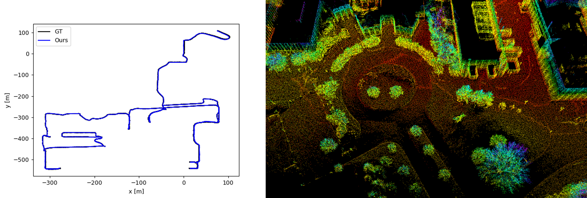
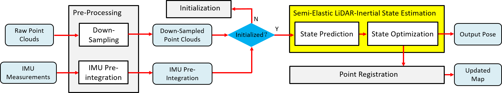

# Semi-Elastic-LIO

**Semi-Elastic-LIO** (Semi-Elastic LiDAR-Inertial Odometry) is an accurate and robust optimization based LiDAR-inertial odometry (LIO). Compared with the previous work which treats the state at the beginning of current sweep as equal to the state at the end of previous sweep, the **Semi-Elastic-LIO** provides the state sufficient flexibility to be optimized to the correct value, thus preferably ensuring improved accuracy, consistency, and robustness of state estimation.

## Related Work

[Semi-Elastic LiDAR-Inertial Odometry]

Authors: [*Zikang Yuan*](https://scholar.google.com/citations?hl=zh-CN&user=acxdM9gAAAAJ), [*Fengtian Lang*](https://scholar.google.com/citations?hl=zh-CN&user=zwgGSkEAAAAJ&view_op=list_works&gmla=ABEO0Yrl4-YPuowyntSYyCW760yxM5-IWkF8FGV4t9bs9qz1oWrqnlHmPdbt7LMcMDc04kl2puqRR4FaZvaCUONsX7MQhuAC6a--VS2pTsuwj-CyKgWp3iWDP2TS0I__Zui5da4), *Tianle Xu*, [*Chengwei Zhao*](https://github.com/chengwei0427) and [*Xin Yang*](https://scholar.google.com/citations?user=lsz8OOYAAAAJ&hl=zh-CN)

## Demo Video (2023-07-17 Update)

The comparison result between our estimated trajectoriy and ground truth on sequence *nclt_2012-04-29* (left), the local point cloud map of *nclt_2012-04-29* (center), and the **x40 Real-Time Performance** on sequence captured by a 16-line Robosense LiDAR and a IMU coming with [*StarNeto*](http://www.starneto.com/) RTK (right). On our currently hardware platform (**Intel Core i7-12700 and 32 GB RAM**), and the **Semi-Elastic-LIO** need **60~70ms** to handle a sweep under this environment.

<div align="left">


</div>

**Pipeline:**
<div align="center">

</div>

**New Features:**
The proposed **Semi-Elastic LiDAR-Inertial State Estimation** method utilizes the point-to-plane constraint to ensure the state at the end of current sweep, and utilizes the logical constraint to ensure the state at the beginning of current sweep. The IMU pre-integration constraints both begin state and end state to make them satisfy kinematic constraints within elastic range. The comparision between our method with the **traditional LiDAR-Inertial State Estimation** and the **Elastic LiDAR-Inertial State Estimation** is illustrated by the figure as follow:
<div align="center">

</div>

## Installation

### 1. Requirements

> GCC >= 5.4.0
>
> Cmake >= 3.0.2
> 
> [Eigen3](http://eigen.tuxfamily.org/index.php?title=Main_Page) >= 3.2.8
>
> [PCL](https://pointclouds.org/downloads/) == 1.7 for Ubuntu 16.04, and == 1.8 for Ubuntu 18.04
>
> [Ceres](http://ceres-solver.org/installation.html) >= 1.14
>
> [ROS](http://wiki.ros.org/ROS/Installation)

##### Have Tested On:

| OS    | GCC  | Cmake | Eigen3 | PCL | Ceres |
|:-:|:-:|:-:|:-:|:-:|:-:|
| Ubuntu 16.04 | 5.4.0  | 3.16.0 | 3.2.8 | 1.7 | 1.14 |
| Ubuntu 18.04 | 7.5.0  | 3.11.2 | 3.3.4 | 1.8 | 1.14 |

### 2. Create ROS workspace

```bash
mkdir -p ~/Semi-Elastic-LIO/src
cd Semi-Elastic-LIO/src
```

### 3. Clone the directory and build

```bash
git clone https://github.com/ZikangYuan/semi_elastic_lio.git
cd ..
catkin_make
```

## Run on Public Datasets

Noted:

A. Except fot the external parameters between IMU and LiDAR, and the value of gravitational acceleration, **the parameter configurations used in different datasets are exactly the same** to demonstrate the stability and robustness of **SR-LIO**.

B. Please make sure the LiDAR point clouds have the "ring" channel information.

C. The warning message "Failed to find match for field 'time'." doesn't matter. It can be ignored.

D. **Please create a folder named "output" before running.** When **SR-LIO** is running, the estimated pose is recorded in real time in the **pose.txt** located in the **output folder**.

E. As the groundtruth acquisition of some datasets (*UTBM* and *ULHK*) are extremely complicated, in order to facilitate evaluation, **we store the pose ground truth of the four datasets used by us as [TUM](https://vision.in.tum.de/data/datasets/rgbd-dataset) format. Please down load from [Google drive](https://drive.google.com/drive/folders/1WnvzUzP_s70p4myPf5fsP1Jtr_62PnL1)**.

###  1. Run on [*NCLT*](http://robots.engin.umich.edu/nclt/)

The time for finishing a sweep by the LiDAR of *NCLT* is not 100ms, but 130~140ms (around 7.5 Hz). Therefore, we need to package the data stream of the *NCLT* dataset as 7.5 Hz sweep packages. The **nclt_to_rosbag.py** in the **"tools"** folder can be used to package 7.5 Hz sweeps and linearly interpolated 100 Hz IMU data into a rosbag file:

```bash
python3 nclt_to_rosbag.py PATH_OF_NVLT_SEQUENCE_FOLDER PATH_OF_OUTPUT_BAG
```

Then, please go to the workspace of **Semi-Elastic-LIO** and type:

```bash
cd Semi-Elastic-LIO
source devel/setup.bash
roslaunch semi_elastic_lio lio_nclt.launch
```

Then open the terminal in the path of the bag file, and type:

```bash
rosbag play SEQUENCE_NAME.bag --clock -d 1.0
```

### 2. Run on [*UTBM*](https://epan-utbm.github.io/utbm_robocar_dataset/#Downloads)

Before evaluating on *UTBM* dataset, a dependency needs to be installed. If your OS are Ubuntu 16.04, please type:

```bash
sudo apt-get install ros-kinetic-velodyne 
```

If your OS are Ubuntu 18.04, please type:

```bash
sudo apt-get install ros-melodic-velodyne 
```

Then open the terminal in the path of **Semi-Elastic-LIO**, and type:

```bash
source devel/setup.bash
roslaunch semi_elastic_lio lio_utbm.launch
```

Then open the terminal in the path of the bag file, and type:

```bash
rosbag play SEQUENCE_NAME.bag --clock -d 1.0
```

### 3. Run on [*ULHK*](https://github.com/weisongwen/UrbanLoco)

For sequence *HK-Data-2019-01-17* and *HK-Data-2019-03-17*, the imu data does not include the gravity acceleration component, and the topic of LiDAR point cloud data is */velodyne_points_0*. For other sequences of *ULHK* used by us, the imu data includes the gravity acceleration component, and the topic of LiDAR point cloud data is */velodyne_points*. Therefore, we provide two launch files for the *ULHK* dataset.

If you test **Semi-Elastic-LIO** on *HK-Data-2019-01-17* or *HK-Data-2019-03-17*, please type:

```bash
source devel/setup.bash
roslaunch semi_elastic_lio lio_ulhk1.launch
```

If you test **Semi-Elastic-LIO** on *HK-Data-2019-03-16-1*, *HK-Data-2019-04-26-1* or *HK-Data-2019-04-26-2*, please type:

```bash
sourcr devel/setup.bash
roslaunch semi_elastic_lio lio_ulhk2.launch
```

Then open the terminal in the path of the bag file, and type:

```bash
rosbag play SEQUENCE_NAME.bag --clock -d 1.0
```
